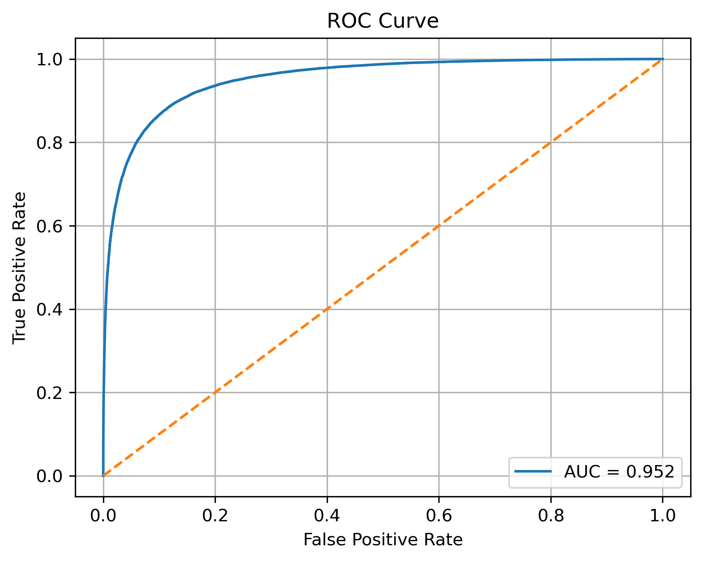

# Heart Disease Prediction

This project applies machine learning techniques to predict the presence of heart disease based on patient medical data.

## Project Overview

The goal of this project is to build a classification model capable of identifying patients at risk of heart disease using clinical features. Several machine learning models were trained and compared, including Logistic Regression, Random Forest, and K-Nearest Neighbors.

The best performance was achieved using Logistic Regression.

## Dataset

The dataset contains medical information about patients, including:

- Age
- Blood pressure
- Cholesterol level
- Maximum heart rate
- Chest pain type
- Exercise-induced angina
- Number of vessels detected by fluoroscopy
- Thallium test results

The dataset used in this project contains approximately **630,000 observations**.

## Data Preprocessing

The following preprocessing steps were applied:

- Standardization of numerical features using StandardScaler
- One-hot encoding for categorical variables
- Binary variables were used without transformation

## Models Tested

The following models were trained and compared:

- Logistic Regression
- Random Forest
- K-Nearest Neighbors
- Support Vector Machine (initially tested)

Hyperparameters were tuned using **GridSearchCV** with **5-fold cross-validation**.

## Results

The best model was **Logistic Regression**, which achieved:

- **Accuracy:** 0.8847
- **ROC AUC:** 0.952

The ROC curve illustrates the ability of the model to distinguish between patients with and without heart disease.  
The model achieved an **AUC score of 0.952**, indicating excellent classification performance.

## Model Evaluation

The model was evaluated using:

- Accuracy score
- Confusion matrix
- ROC curve
- Feature importance analysis

These results demonstrate that the model has strong predictive performance and can effectively distinguish between patients with and without heart disease.

## Technologies Used

- Python
- pandas
- numpy
- scikit-learn
- matplotlib
- seaborn

